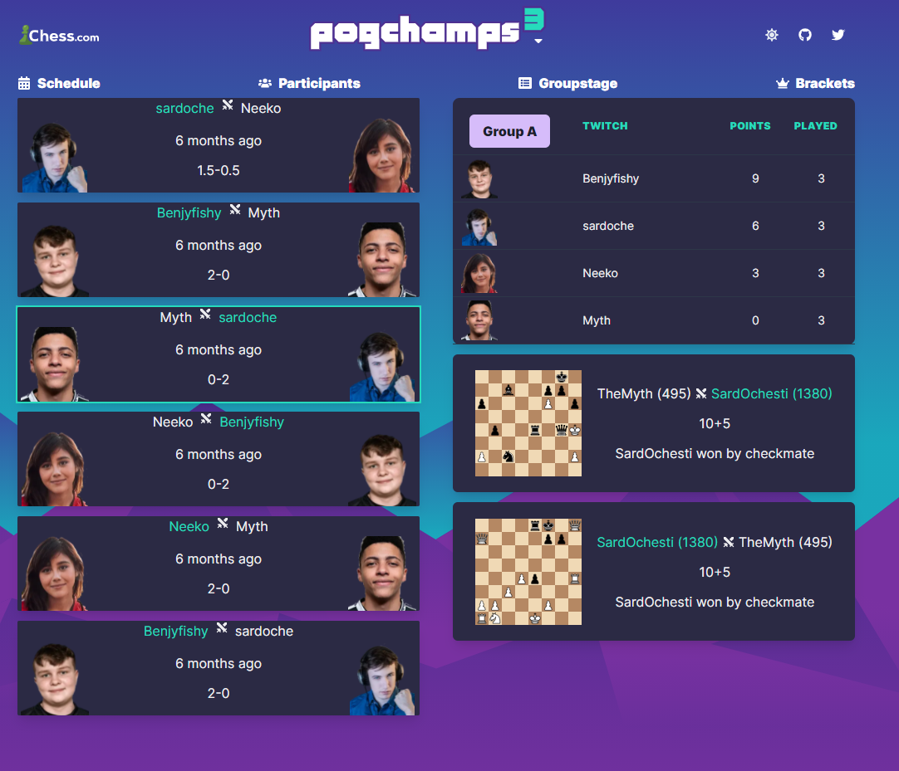

# Pogchamps

[Pogchamps](https://en.wikipedia.org/wiki/PogChamps) is a chess tournament for streamers organised by [chess.com](https://chess.com).

[This site](https://pogchamps.chess.com/) covers all events and includes :
- standings for the groupstages
- Championship and consolation brackets
- players up to date chess.com ratings
- all matchs and results
- all games through a pgn viewer

# Structure

- `server/` : Symfony 4.4 used as a REST API.
- `client/` : Angular 8
- `games-import/` : custom SQL and python scripts.

Backend and frontend servers are both hosted on Heroku, respectively :
- https://apichamps.herokuapp.com/
- https://pogchamps.herokuapp.com/
